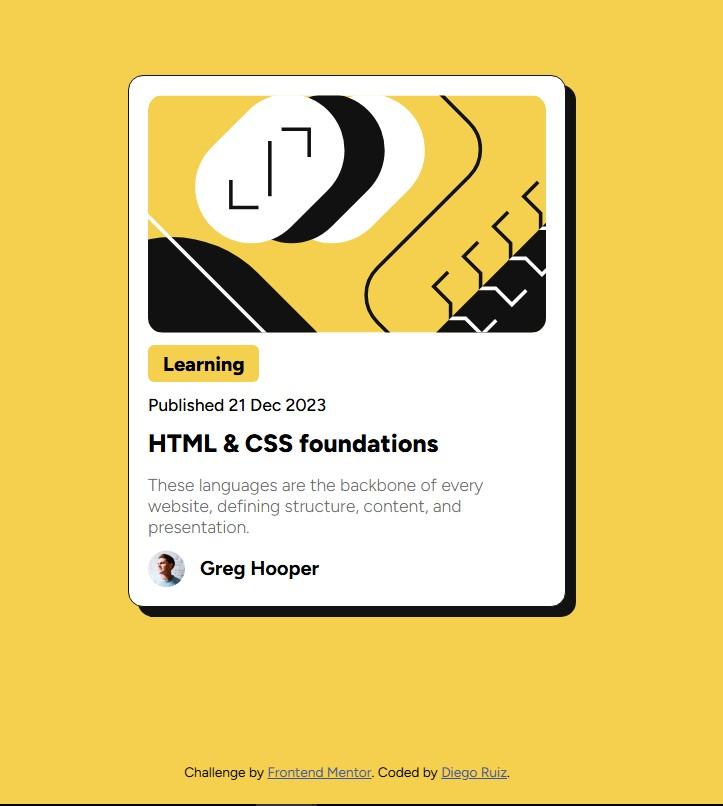

Frontend Mentor - Blog preview card solution
This is a solution to the Blog preview card challenge on Frontend Mentor.

Overview
The challenge
Users should be able to:

View the optimal layout depending on their device's screen size

See hover states for interactive elements

Screenshot

Links
Solution URL: GitHub Repository

Live Site URL: Live Demo

My process
Built with
Semantic HTML5 markup

CSS custom properties

Flexbox

Mobile-first workflow

Google Fonts

What I learned
Key CSS techniques used in this project:

css
/_ Centering with Flexbox _/
body {
display: flex;
flex-direction: column;
justify-content: center;
align-items: center;
min-height: 100vh;
}

/_ Card styling with shadow effect _/
.card {
border: 1px solid hsl(0, 0%, 7%);
box-shadow: 8px 8px 0px hsl(0, 0%, 7%);
transition: box-shadow 0.3s ease;
}

.card:hover {
box-shadow: 12px 12px 0px hsl(0, 0%, 7%);
}

/_ Learning tag styling _/
.learning-tag {
background-color: hsl(47, 88%, 63%);
padding: 4px 12px;
border-radius: 4px;
display: inline-block;
}
Continued development
I want to focus on:

CSS Grid for complex layouts

Advanced animations

Accessibility improvements

Performance optimization

Author
Frontend Mentor - @DiegoRuiz8

GitHub - DiegoRuiz8
